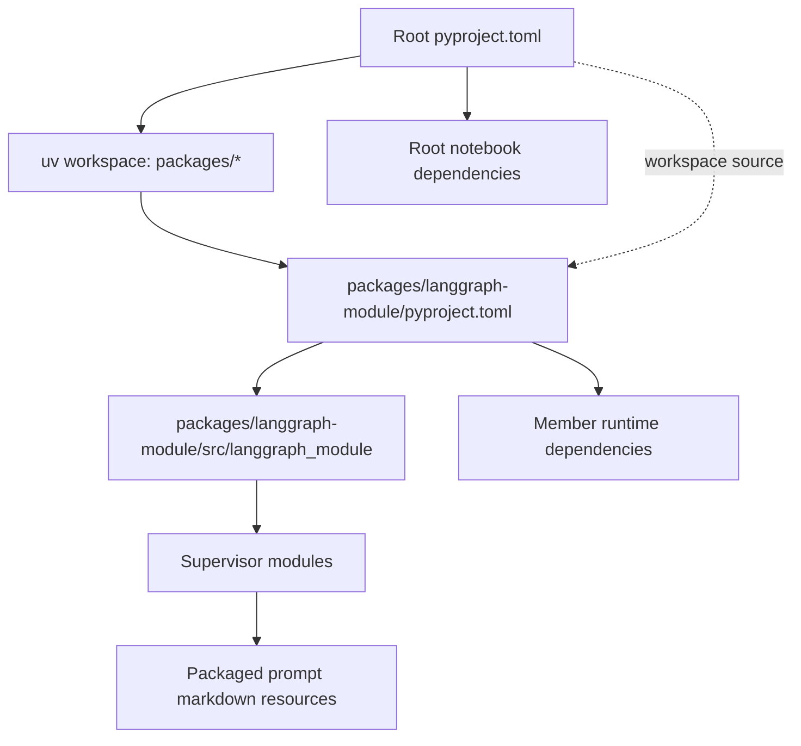

# uv Workspace and LangGraph Package Design

**Spec**: `.specs/features/uv-workspace-packaging/spec.md`
**Status**: Draft

## Architecture Overview

Use the repository root as the uv workspace root and retain it as the notebook/application project. Discover workspace members with a glob so future packages can be added without changing root workspace metadata:

```toml
[tool.uv.workspace]
members = ["packages/*"]
```

The current member will be moved to `packages/langgraph-module/`. Its distribution name is `langgraph-module`; its import package remains `langgraph_module` and lives below `src/`.



The workspace has one root `uv.lock`. The root uses the member through a workspace source when root commands need the package; uv resolves the member editably rather than from a registry.

## Code Reuse Analysis

### Existing Components to Leverage

| Component | Location | How to Use |
| --- | --- | --- |
| Existing root dependency metadata | `pyproject.toml` | Preserve notebook/application dependencies at the root and add workspace configuration. |
| Existing LangGraph package code | `langgraph_module/**/*.py` | Move without changing graph behavior; only update imports and resource access required by package execution. |
| Existing prompts and content | `langgraph_module/multi_agent/supervisor/{prompts,example_content,ai_files}` | Move as package resources and preserve their contents. |
| Existing Python version pin | `.python-version` | Align the pin with the `requires-python` constraints of the root and member. |
| Existing lockfile | `uv.lock` | Regenerate as the single workspace lockfile after metadata and dependency ownership are finalized. |

### Integration Points

| System | Integration Method |
| --- | --- |
| uv workspace | Root `[tool.uv.workspace] members = ["packages/*"]`. |
| Root project to member | Root dependency on `langgraph-module` with `[tool.uv.sources] langgraph-module = { workspace = true }`, if root code/notebooks import the package directly. |
| Python package execution | `uv run --package langgraph-module python -m langgraph_module.multi_agent.supervisor.main`. |
| Prompt resources | Resolve markdown relative to the supervisor package using a package-safe resource mechanism; configure the build backend to include required markdown files. |
| Built artifacts | Build the member and inspect wheel/sdist contents for prompt resources and import package files. |

## Components

### Workspace Root Metadata

- **Purpose**: Define one workspace and retain the root notebook environment.
- **Location**: `pyproject.toml`
- **Interfaces**:
  - `[tool.uv.workspace] members = ["packages/*"]`
  - Optional root `[tool.uv.sources]` entry for the member using `{ workspace = true }`.
  - Root package mode disabled only if the root has no importable package.
- **Dependencies**: uv; existing root dependencies.
- **Reuses**: Current root project metadata and dependency list.

### LangGraph Distribution Package

- **Purpose**: Own metadata, direct runtime dependencies, documentation, and build configuration for the LangGraph examples.
- **Location**: `packages/langgraph-module/`
- **Interfaces**:
  - Distribution/project name: `langgraph-module`.
  - Python import name: `langgraph_module`.
  - Source root: `packages/langgraph-module/src/`.
- **Dependencies**: A uv-supported PEP 517 build backend; direct dependencies derived from imports in the moved package.
- **Reuses**: Existing LangGraph module code and resource files.

### Supervisor Runtime Package

- **Purpose**: Preserve the existing supervisor/researcher/copywriter graph while making imports and resource lookup independent of the caller's working directory.
- **Location**: `packages/langgraph-module/src/langgraph_module/multi_agent/supervisor/`
- **Interfaces**:
  - Module execution: `python -m langgraph_module.multi_agent.supervisor.main`.
  - Internal imports use explicit relative or fully qualified package imports.
  - Prompt loading uses package-relative/resource-safe access.
- **Dependencies**: Member runtime dependencies and package data configuration.
- **Reuses**: Existing graph definitions, prompts, example content, and AI files without behavior changes.

### Verification Gates

- **Purpose**: Prove workspace resolution, package importability, resource inclusion, and root/member dependency boundaries without making external API calls.
- **Location**: Command-based verification; no existing test directory or test runner was found.
- **Interfaces**:
  - `uv lock --check`
  - `uv sync`
  - `uv tree`
  - Member import/resource smoke checks.
  - `uv build --package langgraph-module` and artifact inspection.
- **Dependencies**: uv and the configured compatible Python interpreter.
- **Reuses**: Existing package resources and metadata; no new test framework is introduced.

## Data Models

No application data models are introduced. The packaging model is:

| Name | Value |
| --- | --- |
| Workspace member directory | `packages/langgraph-module` |
| Distribution/uv name | `langgraph-module` |
| Python import package | `langgraph_module` |
| Python source root | `packages/langgraph-module/src` |
| Shared lockfile | `uv.lock` at repository root |

## Error Handling Strategy

| Error Scenario | Handling | User Impact |
| --- | --- | --- |
| Workspace glob matches a directory without `pyproject.toml` | Keep the member glob limited to package directories and require every immediate member directory to contain metadata; let `uv lock` fail clearly for invalid members. | Maintainers receive a direct configuration error instead of a partially resolved workspace. |
| Python pin is incompatible with root/member requirements | Align `.python-version` and `requires-python`; do not weaken constraints to hide the mismatch. | `uv sync` either succeeds on the documented interpreter or reports a clear compatibility error. |
| Prompt resource missing from package artifact | Add explicit package-data/build configuration and artifact inspection to the build gate. | Build verification catches the issue before a user runs the supervisor. |
| Supervisor invoked from another working directory | Use package-safe imports/resources. | The documented module command works from the repository root and does not require `cd`. |
| API credentials unavailable during packaging checks | Keep import checks free of live model/search calls and document live execution separately. | Developers can validate packaging offline without exposing or supplying secrets. |

## Risks & Concerns

| Concern | Location | Impact | Mitigation |
| --- | --- | --- | --- |
| Current supervisor modules use sibling imports such as `from researcher import ...`. | `langgraph_module/multi_agent/supervisor/supervisor.py:12-13` | Module execution from the root raises `ModuleNotFoundError`. | Update to package-qualified/relative imports and verify with `python -m`. |
| Current prompt reads use process-relative paths. | `researcher.py:18`, `supervisor.py:19`, and analogous copywriter code | Running from the root raises `FileNotFoundError`. | Use package-safe resource resolution and test from a different working directory. |
| No test framework or test files were found. | Repository root | Regression coverage could be weak if verification is informal. | Make command-based import, resource, lock, sync, tree, build, and artifact inspection gates explicit in `tasks.md`; do not add unrelated test infrastructure. |
| Root currently owns all dependencies, including package runtime dependencies. | `pyproject.toml:7-21` | The package may not be independently buildable or may accidentally rely on transitive root dependencies. | Audit direct imports and declare package dependencies in the member; preserve notebook-only dependencies at the root. |
| Existing `.python-version` uses `3.12` while prior uv output showed an exact-version compatibility failure in one project state. | `.python-version` and project metadata | Sync can fail before package verification. | Choose one compatible Python policy and verify `uv sync` from a clean workspace state. |

## Tech Decisions

| Decision | Choice | Rationale |
| --- | --- | --- |
| Workspace member discovery | `packages/*` | Supports future packages and matches the requested immediate-directory convention. |
| Package layout | `packages/<distribution>/src/<import_name>/` | Separates distribution names from Python import names and follows conventional uv package structure. |
| Build backend | Use the backend generated/supported by `uv init --package` or an equivalent uv-compatible PEP 517 configuration; do not hand-invent a backend during task execution. | Keeps metadata aligned with uv's current package scaffolding. |
| Resource loading | Package-relative/resource-safe lookup plus explicit inclusion in the built artifact. | Fixes the current cwd dependency while preserving prompt contents. |
| Verification style | Offline command-based smoke/build gates; no new test framework. | The repository has no existing tests and the requested change is packaging/configuration focused. |

## Implementation Order

1. Establish the root workspace metadata and `packages/` member path.
2. Create member metadata, build configuration, and README.
3. Move the existing source/resources into the member `src/` layout.
4. Repair package imports and resource loading.
5. Audit dependency ownership, align Python metadata, and regenerate the lockfile.
6. Run all workspace, import, resource, build, and artifact gates.
